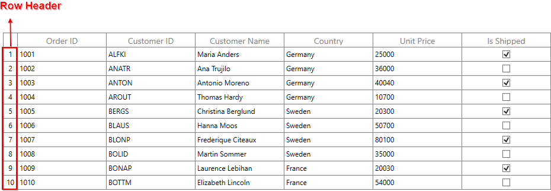
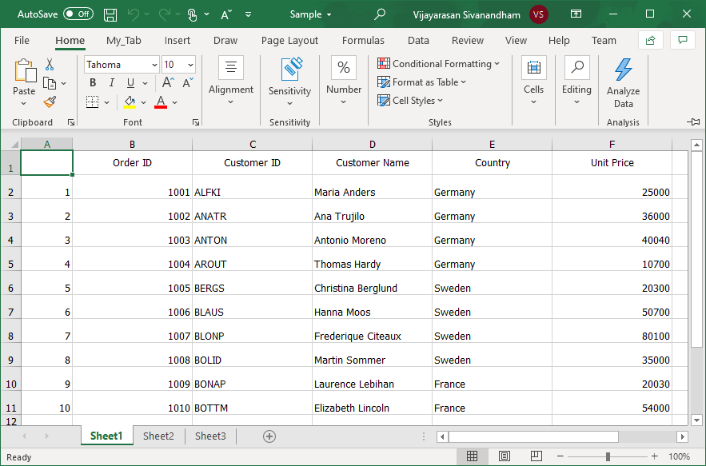

# How to export the WPF DataGrid (SfDataGrid) to excel with RowHeader?

## About the sample
This example illustrates how to export the [WPF DataGrid](https://www.syncfusion.com/wpf-controls/datagrid) (SfDataGrid) to excel with RowHeader?

[WPF DataGrid](https://www.syncfusion.com/wpf-controls/datagrid) (SfDataGrid) does not provide the support to export the row header. You can export the row header column by using **Worksheet.InsertColumn** method to insert column manually in ExcelSheet and make customization in inserted column.

```C#

private void btnExportToExcel_Click(object sender, RoutedEventArgs e)
{
            var options = new ExcelExportingOptions();
            options.ExcelVersion = ExcelVersion.Excel2013;
            var excelEngine = sfDataGrid.ExportToExcel(sfDataGrid.View, options);
            var workBook = excelEngine.Excel.Workbooks[0];

            IWorksheet sheet = workBook.Worksheets[0];

            sheet.InsertColumn(1, 1, ExcelInsertOptions.FormatDefault);
            var rowcount = this.sfDataGrid.RowGenerator.Items.Count;

            for (int i = 1; i < rowcount; i++)
            {
                sheet.Range["A" + (i + 1).ToString()].Number = i;
            }

            SaveFileDialog sfd = new SaveFileDialog
            {
                FilterIndex = 2,
                Filter = "Excel 97 to 2003 Files(*.xls)|*.xls|Excel 2007 to 2010 Files(*.xlsx)|*.xlsx|Excel 2013 File(*.xlsx)|*.xlsx"
            };

            if (sfd.ShowDialog() == true)
            {
                using (Stream stream = sfd.OpenFile())
                {
                    if (sfd.FilterIndex == 1)
                        workBook.Version = ExcelVersion.Excel97to2003;
                    else if (sfd.FilterIndex == 2)
                        workBook.Version = ExcelVersion.Excel2010;
                    else
                        workBook.Version = ExcelVersion.Excel2013;
                    workBook.SaveAs(stream);
                }

                //Message box confirmation to view the created workbook.
                if (MessageBox.Show("Do you want to view the workbook?", "Workbook has been created",
                                    MessageBoxButton.YesNo, MessageBoxImage.Information) == MessageBoxResult.Yes)
                {

                    //Launching the Excel file using the default Application.[MS Excel Or Free ExcelViewer]
                    System.Diagnostics.Process.Start(sfd.FileName);
                }
            }
}

```

The following screenshot illustrates the RowHeader displayed in [WPF DataGrid](https://www.syncfusion.com/wpf-controls/datagrid) (SfDataGrid),


The following screenshot illustrates exported Excel Sheet with RowHeader,


Take a moment to peruse the [WPF DataGrid - Export To Excel](https://help.syncfusion.com/wpf/datagrid/export-to-excel) documentation, where you can find about export to excel with code examples.

## Requirements to run the demo
Visual Studio 2015 and above versions
